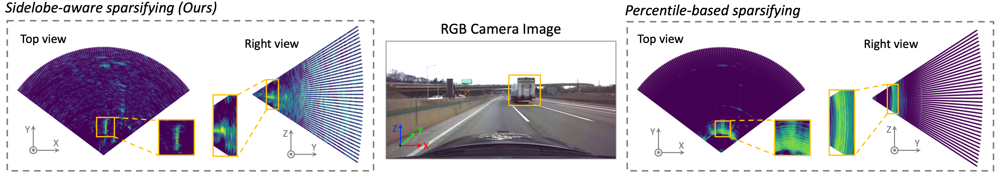

<div align="center">   

# RadarOcc: Robust 3D Occupancy Prediction with 4D Imaging Radar
</div>

<div align="center">   

[](https://arxiv.org/abs/2405.14014) 
[](https://www.youtube.com/watch?v=sa4gejcWMvk)
[](LICENSE) [](https://toytiny.github.io/publication/24-radarocc-neurips/)


</div>
<p align="center">

</p>


This is the official repository of the **RadarOcc**, a pioneering appraoch for 3D occupancy prediction based on 4D imaging radar. 
For technical details, please refer to our paper on NeurIPS 2024:


**RadarOcc: Robust 3D Occupancy Prediction with 4D Imaging Radar**
<br/>
[Fangqiang Ding<sup>1,*</sup>](https://toytiny.github.io/), [Xiangyu Wen<sup>1,*</sup>](https://scholar.google.com/citations?user=WxgdNyAAAAAJ&hl=en&oi=ao), [Yunzhou Zhu<sup>2</sup>](https://lawrencez22.github.io/), [Yiming Li<sup>3</sup>](https://yimingli-page.github.io/), [Chris Xiaoxuan Lu<sup>4,†</sup>](https://christopherlu.github.io/)
<br/>
[[arXiv]](https://arxiv.org/abs/2405.14014) [[page]](https://toytiny.github.io/publication/24-radarocc-neurips/) [[demo]](https://youtu.be/sa4gejcWMvk) [[slide]](https://nips.cc/media/neurips-2024/Slides/96791.pdf)
<br/>
<sup>1</sup>University of Edinburgh, <sup>2</sup>Georgia Institute of Technology, <sup>3</sup>NYU, <sup>4</sup>UCL
<br/>
*Equal contribution, †Corresponding author

<p align="left">

</p>

## 🔥 News
- [2024-05-22] Our preprint paper is available on 👉[arXiv](https://arxiv.org/abs/2405.14014).
- [2024-09-26] Our paper is accepted by [NeurIPS 2024](https://neurips.cc/) 🎉.
- [2024-11-04] Our network and training code is uploaded. Stay tuned for update👀!
- [2024-11-11] Our demo video is available online. Watch it via 👉[Youtube](https://www.youtube.com/watch?v=sa4gejcWMvk). GIFs are also provided 🔗[below](#qualitative-results).
- [2024-11-12] Our paper 👉[slides](https://nips.cc/media/neurips-2024/Slides/96791.pdf) and [recording](https://recorder-v3.slideslive.com/?share=95505&s=cfe10684-4448-4e15-8277-a7e18080730f) have been uploaded to offical website.
- [2024-11-16] Our project page is published. Please have a look👉[page](https://toytiny.github.io/publication/24-radarocc-neurips/).
- [TODO] Provide the illustration for dataset preparation and weight.

## 🔗 Citation
If you find our work helpful to your research, please consider citing:


```shell
@article{Ding_2024_NeurIPS,
  title={Robust 3D Occupancy Prediction with 4D Imaging Radar},
  author={Ding, Fangqiang and Wen, Xiangyu and Zhu, Yunzhou and and Li, Yiming and Lu, Chris Xiaoxuan},
  journal={Advances in Neural Information Processing Systems (NeurIPS)},
  year={2024}
}
```
## 📝 Abstract 

3D occupancy-based perception pipeline has significantly advanced autonomous
driving by capturing detailed scene descriptions and demonstrating strong generalizability across various object categories and shapes. Current methods predominantly
rely on LiDAR or camera inputs for 3D occupancy prediction. These methods are
susceptible to adverse weather conditions, limiting the all-weather deployment of
self-driving cars. To improve perception robustness, we leverage the recent advances in automotive radars and introduce a novel approach that utilizes 4D imaging
radar sensors for 3D occupancy prediction. Our method, RadarOcc, circumvents
the limitations of sparse radar point clouds by directly processing the 4D radar
tensor, thus preserving essential scene details. RadarOcc innovatively addresses the
challenges associated with the voluminous and noisy 4D radar data by employing
Doppler bins descriptors, sidelobe-aware spatial sparsification, and range-wise
self-attention mechanisms. To minimize the interpolation errors associated with
direct coordinate transformations, we also devise a spherical-based feature encoding followed by spherical-to-Cartesian feature aggregation. We benchmark various
baseline methods based on distinct modalities on the public K-Radar dataset. The
results demonstrate RadarOcc’s state-of-the-art performance in radar-based 3D
occupancy prediction and promising results even when compared with LiDARor camera-based methods. Additionally, we present qualitative evidence of the
superior performance of 4D radar in adverse weather conditions and explore the
impact of key pipeline components through ablation studies.

## 📦 Method
|  | 
|:--:| 
| <div align="left">***Figure 1. Overall pipeline of RadarOcc**. The data volume reduction pre-processes the 4DRT into a lightweight sparse RT via Doppler bins encoding and sidelobe-aware spatial sparifying. We apply spherical-based feature encoding on the sparse RT and aggregate the spherical features using Cartesian voxel queries. The 3D occupancy volume is finally output via 3D occupancy decoding.*</div> |


## 🏞️ Qualitative results
Here are some GIFs showing our qualitative results on 3D occupancy prediction. Foreground voxels are colored as <span style="color:red;">red</span> while background voxels
<span style="color: green;">are green</span>.
 Some of these results can also be found in our supplementary [demo video](https://youtu.be/sa4gejcWMvk).

#### Normal weathers

<p align="center">
  
  
</p>
<p align="center">
  
  
</p>

#### Adverse weathers (in comparison with LiDAR and RGB camera)


## 🚀 Getting Started
### Dataset preprocessing
1. Download the Kradar Dataset.
2. Occ GT generation. radarocc follow [SurroundOcc](https://github.com/weiyithu/SurroundOcc) to generate occupancy gt using the os-2 64 lidar in the Kradar dataset.
To use our config for the occ generation, please clone this repo, modify the root path at [here](https://github.com/Toytiny/RadarOcc/blob/f2ab7c2d31c654070cdc96c97995bb2a378cba90/tools/process_kradar.py#L259) and
```
cd tools
python process_kradar.py
python filter_kradar_fov.py
```

3. The [generate_4d_polar_percentil.py](generate_4d_polar_percentil.py) preprocess the raw radar data using Sidelobe-aware spatial sparsifying
```
cd ..
python generate_4d_polar_percentil.py
```

4. Please define your train/test/val set by generating .pkl files for the mmdet3d framework, we provide a jupyter notebook [convert_kradar.ipynb](convert_kradar.ipynb) for this.

### Getting Started
Please follow installation instructions from OpenOccupancy

- [Installation](docs/install.md)

Additionly, Radarocc use 3d deformable attn as VoxFormer, please install it in  [VoxFormer/deform_attn_3d](https://github.com/NVlabs/VoxFormer/tree/main/deform_attn_3d)

For training, evaluation and viuslization, please refer to OpenOccupancy
- [Training, Evaluation, Visualization](docs/trainval.md)
For example, radarocc can be trained use at least two 24G GPUs
```
bash run.sh ./projects/baselines/RadarOcc_self.py 2
```
the smaller and faster version radarocc-S
```
bash run.sh ./projects/baselines/RadarOcc_Small.py 2
```

## Acknowledgement

Many thanks to these excellent projects:
- [SurroundOcc](https://github.com/weiyithu/SurroundOcc)
- [OpenOccupancy](https://github.com/JeffWang987/OpenOccupancy)
- [VoxFormer](https://github.com/NVlabs/VoxFormer)
